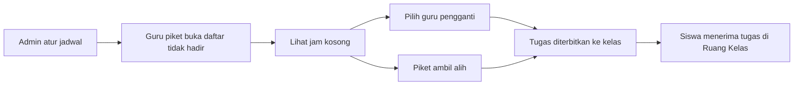
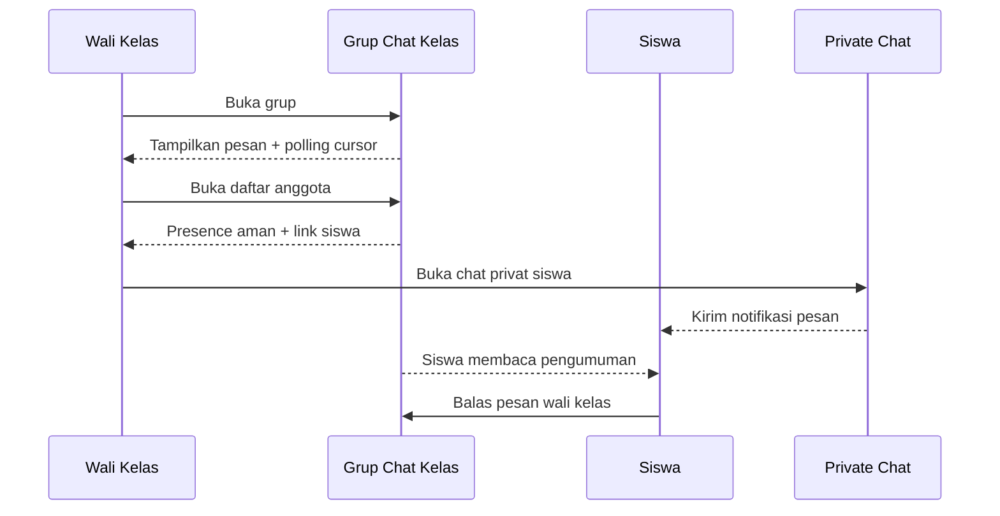

# Storyboard — Piket Guru dan Grup Chat

Storyboard ini menggambarkan alur yang perlu terlihat saat demo dan saat UAT.
Setiap frame memiliki versi mobile sebagai acuan utama dan versi desktop sebagai
layout yang lebih lega.

## Alur Piket Guru

### Frame P1 — Admin mengatur jadwal

| Komponen | Mobile | Desktop |
|---|---|---|
| Konteks | Tabel digeser horizontal | Tabel penuh terlihat |
| Aksi | Centang `Piket`, lalu pilih `Ketua` | Sama, dengan ruang antar kolom lebih lega |
| Feedback | Toast berhasil/gagal | Toast + tabel tetap pada posisi |
| Risiko | Salah memilih ketua | Terlalu banyak kolom kosong |

**Narasi:** Admin memilih guru piket untuk Senin–Jumat. Satu ketua wajib ada
untuk setiap hari. Saat checkbox piket dilepas, radio ketua guru tersebut ikut
dibersihkan.

### Frame P2 — Guru piket melihat kondisi pagi

| Komponen | Mobile | Desktop |
|---|---|---|
| Header | Judul dan tanggal bertumpuk | Judul, tanggal, dan link sejajar |
| Konten | Kartu guru tidak hadir satu kolom | Daftar lebih lega dengan metadata inline |
| Aksi | `Lihat jam kosong` full-width | Tombol di sisi kartu |
| Feedback | Badge alasan dan sumber | Badge + detail lebih panjang |

**Narasi:** Guru piket tidak perlu mencocokkan jadwal manual. Sistem sudah
menurunkan jam kosong dari jadwal sekolah untuk tanggal tersebut.

### Frame P3 — Menentukan pengganti

| Komponen | Mobile | Desktop |
|---|---|---|
| Slot | Satu kartu per jam kosong | Satu kartu per slot, tetap tidak berupa tabel padat |
| Kandidat | Dropdown full-width | Dropdown dan tombol dapat berdampingan |
| Aksi alternatif | `Saya yang masuk` di bawah tombol utama | Dua tombol dalam satu baris |
| Status | `Menunggu`, `Ditugaskan`, `Selesai` | Status dan nama pengisi terlihat sekaligus |

**Narasi:** Kandidat yang sedang mengajar, tidak hadir, atau sudah mengisi slot
lain tidak muncul. Server tetap memvalidasi ulang kandidat ketika tombol ditekan.

### Frame P4 — Guru asli mengirim tugas

| Komponen | Mobile | Desktop |
|---|---|---|
| Laporan absen | Satu kolom | Alasan dan keterangan dua kolom |
| Tugas | Judul, instruksi, file bertumpuk | Kartu lebih lebar namun tetap vertikal |
| Aksi | `Kirim` full-width | `Kirim` full-width di dalam kartu |
| Feedback | `Sudah dikonfirmasi` / `Sudah diterbitkan` | Badge + detail kelas/jam |

**Narasi:** Guru yang berhalangan mengirim tugas dari HP. Guru piket kemudian
dapat mengonfirmasi atau membuat titip tugas manual.

### Frame P5 — Siswa menerima tugas

| Komponen | Hasil |
|---|---|
| Agenda | Entri kegiatan kelas dibuat otomatis |
| Ruang Kelas | Classroom Assignment berstatus published |
| File | File tugas tersedia melalui assignment |
| Batasan | Jam istirahat/upacara tanpa kelas/mapel tidak membuat assignment |

## Alur Grup Chat Kelas

### Frame G1 — Membuka Grup Kelas

- Header menampilkan nama grup dan jumlah anggota.
- Mobile memprioritaskan area pesan; header tidak boleh mengambil tinggi berlebihan.
- Polling mengambil pesan setelah cursor terakhir.
- Jika backlog lebih dari batas batch, cursor maju ke pesan terakhir yang benar-benar diterima.

### Frame G2 — Memuat riwayat lama

- Tombol `Muat pesan sebelumnya` berada di bagian atas area pesan.
- Saat ditekan, pesan lama disisipkan tanpa memindahkan posisi baca secara tiba-tiba.
- Anggota baru tidak dapat membaca pesan sebelum `joined_seq`.
- Mobile tetap mempertahankan scroll position setelah batch masuk.

### Frame G3 — Membalas di mode pengumuman

1. Siswa melihat composer terkunci.
2. Siswa menekan `Balas` pada pesan wali kelas.
3. Preview pesan yang dibalas muncul di atas composer.
4. Siswa mengirim balasan.
5. Pesan baru masuk lewat polling tanpa reload.

### Frame G4 — Membuka daftar anggota

- Modal hampir penuh di mobile, tetapi memiliki margin aman dari tepi layar.
- Daftar dapat discroll independen.
- Nama anggota diurutkan alfabetis.
- Label presence tidak membocorkan timestamp mentah.
- Wali kelas melihat link Private Chat pada target yang valid.

### Frame G5 — Private Chat

| Tahap | Feedback visual |
|---|---|
| Buka | Header berisi nama target dan tombol kembali |
| Tulis | Textarea fleksibel, tidak mendorong tombol keluar layar |
| Emoji | Panel grid muncul di atas composer dan tetap dalam viewport |
| Kirim | Bubble baru muncul di bawah dan polling tetap aktif |
| Notifikasi | Penerima mendapat notifikasi `private_chat` |

## Kriteria Demo

- Demo mobile dimulai pada lebar 360px.
- Demo desktop dilakukan pada lebar 1280px.
- Setiap alur menunjukkan state kosong, loading, sukses, dan error minimal sekali.
- Demo tidak menggunakan data dummy untuk daftar guru, anggota, kandidat, atau pesan.
- Screenshot aktual dapat ditambahkan setelah verifikasi browser sungguhan.
