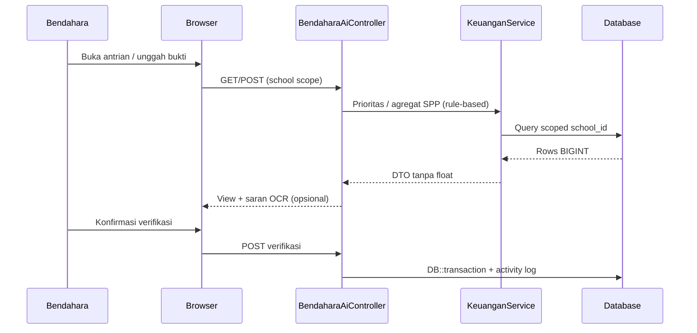

# PRD — AI Keuangan Operasional SIMS (Bendahara SPP)

## 1. Overview

Bendahara sekolah menghabiskan waktu besar untuk memverifikasi bukti transfer SPP, mengejar antrian pembayaran tertunda, dan menyusun ringkasan pendapatan bulanan dari data yang tersebar di modul keuangan SIMS. Modul ini menambah lapisan **asisten operasional berbasis aturan dan AI terbatas** di atas data keuangan yang sudah ada: prioritas antrian verifikasi, saran OCR bukti (bukan keputusan otomatis), dashboard SPP, parser rekening koran yang lebih luas, dan jejak audit transisi status. Semua nominal tetap dihitung dan disimpan oleh sistem (BIGINT rupiah); AI tidak menghitung ulang uang.

## 2. Non-tujuan

* **Bukan pengganti ARKAS / SAK / pelaporan DJPK** — tidak menghasilkan laporan resmi pemerintah atau mengubah struktur akuntansi sekolah.
* **Bukan otomasi penuh persetujuan pembayaran** — setiap verifikasi dan posting tetap membutuhkan bendahara (human-in-the-loop).
* **Bukan duplikasi Narasi Data pimpinan** — fitur `AiAnalyzeController` / narasi agregat untuk kepala sekolah tidak disalin untuk bendahara; akses bendahara fokus operasional SPP dan bukti.
* **Bukan kalkulator rupiah berbasis LLM** — model tidak menentukan atau mengoreksi nominal; hanya menyarankan teks dari gambar/PDF dengan konfirmasi manusia.

## 3. Personas

| Persona | Kebutuhan utama |
|---------|-----------------|
| **Bendahara** | Antrian prioritas, cek bukti cepat, ringkasan SPP bulanan, impor mutasi rekening, jejak perubahan status. |
| **Kepala sekolah / pimpinan** | Tetap memakai Narasi Data existing (di luar scope bendahara). |
| **Admin sekolah** | Mengatur izin modul, API key OCR (jika ada), tanpa akses ke data siswa lintas sekolah. |

## 4. Requirements

* **Akurasi uang:** Semua nominal BIGINT (rupiah penuh), agregasi via query/BCMath di server; AI hanya mengekstrak saran teks, tidak menulis nominal ke DB tanpa validasi bendahara.
* **Multi-tenant:** Semua query dan policy memakai `school_id` + global scope; tidak ada filter manual per controller.
* **Keamanan & audit:** Transisi status pembayaran/verifikasi tercatat di activity log; policy Spatie untuk role `bendahara` (dan turunan yang disepakati).
* **Human-in-the-loop:** OCR dan saran matching hanya prefilled form; bendahara wajib konfirmasi sebelum simpan.
* **Bahasa Indonesia:** Label UI, pesan error, dan dokumentasi internal modul.

## 5. Roadmap fase

### Fase A — AI Bendahara SPP Operasional [High]

Fondasi operasional harian bendahara (rule-based + asisten OCR terbatas).

* **A1 Antrian prioritas verifikasi:** Skor prioritas deterministik (jatuh tempo, nominal tertunggak, usia bukti, dll.) — tanpa LLM.
* **A2 OCR asisten bukti:** Unggah foto/PDF → saran nama, tanggal, referensi; nominal disarankan hanya sebagai teks untuk dicek, tidak auto-post.
* **A3 Dashboard pendapatan SPP bulanan:** Grafik dan tabel agregat dari data SIMS (rule-based).
* **A4 Parser rekening koran:** Perluasan format bank di luar BCA (deteksi kolom + mapping konfigurasi).
* **A5 Activity log transisi keuangan:** Log setiap perubahan status verifikasi/pembayaran terkait SPP.

Ref detail: `features/01-ai-bendahara-spp-fase-a.md`

### Fase B — Matching & rekonsiliasi cerdas [Medium]

* Saran pencocokan mutasi rekening ↔ tagihan SPP (skor aturan + optional embedding teks, tetap konfirmasi bendahara).
* Deteksi duplikat bukti dan anomali nominal (flag, bukan blok otomatis).
* Notifikasi ringkas antrian menumpuk (in-app / digest).

### Fase C — Wawasan & efisiensi lanjutan [Low]

* Ringkasan naratif **non-nominal** untuk internal bendahara (trend keterlambatan, pola hari bayar) — terpisah dari Narasi Data pimpinan.
* Ekspor paket kerja verifikasi (PDF/Excel) untuk arsip sekolah.
* Integrasi opsional gateway pembayaran (hanya jika kebijakan sekolah mengizinkan; tetap BIGINT + audit).

## 6. Architecture (ringkas)

Monolith Laravel 12 + Blade/Livewire/Alpine. Controller bendahara terpisah dari `AiAnalyzeController`. Layanan OCR memanggil provider terkonfigurasi; hasil disimpan sementara sebagai draft, bukan transaksi final.

## 7. Tech Stack

Stack FL: Laravel 12, UUID `HasUuids`, `school_id` global scope, Spatie permission & activitylog, uang BIGINT + BCMath, UI Bahasa Indonesia.

## 8. Database (perubahan direncanakan Fase A)

Perluasan minimal pada tabel keuangan/verifikasi yang sudah ada (nama pasti mengikuti skema SIMS saat implementasi):

* Kolom/status untuk **antrian prioritas** (computed atau materialized score).
* Tabel atau kolom **draft saran OCR** (JSON, TTL, tidak menggantikan bukti resmi).
* Entri **activity log** untuk event: `spp_verifikasi_diajukan`, `spp_verifikasi_disetujui`, `spp_verifikasi_ditolak`, `mutasi_rekening_diimpor`.

Detail migration ditulis saat task implementasi Fase A (gate approval FL).
