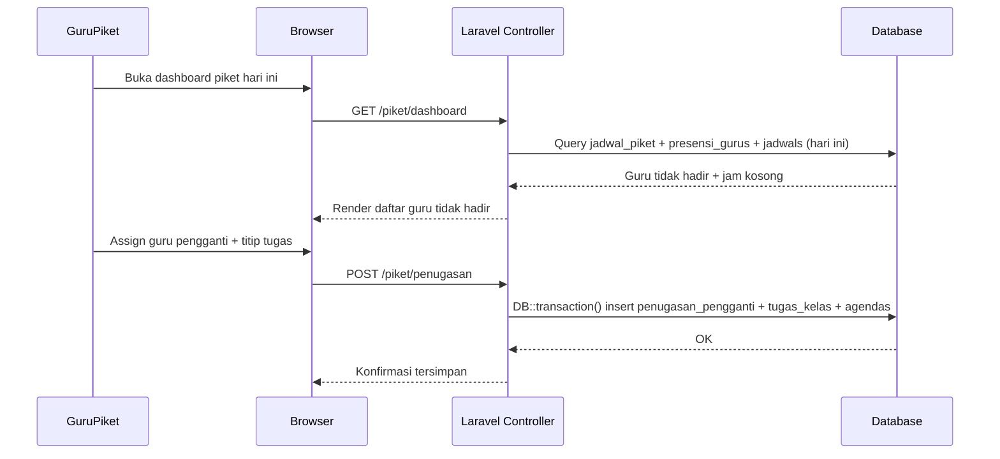
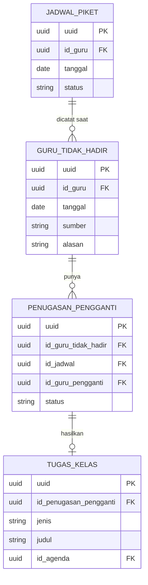

# PRD — Piket Guru & Substitusi Kelas

> Modul terpisah dari Arena Belajar (root `PRD.md`/`features/`). Baca file ini + seluruh isi `docs/piket-guru/features/` sebelum mengerjakan task modul ini. Status di `docs/piket-guru/PROGRESS.md`.

## 1. Overview
Selama ini jadwal piket guru diumumkan manual (dicetak/ditempel), dan saat ada guru tidak hadir, guru piket harus mencari pengganti dan menitip tugas secara ad-hoc tanpa tercatat rapi di sistem. Modul ini menyatukan jadwal piket rotasi, pencatatan guru tidak hadir, penugasan pengganti, dan distribusi tugas ke kelas — semuanya terhubung ke modul `Absensi PTK` dan `Buku Agenda` yang sudah ada di SIMS, supaya tidak ada duplikasi data presensi guru dan setiap tugas yang dititip otomatis masuk ke agenda kelas. Penggunanya: Guru Piket (operasional harian), Admin (atur rotasi), Kepala Sekolah (monitor), dan Guru (submit tugas saat berhalangan).

## 2. Requirements
* **Terintegrasi dengan modul existing:** Guru tidak hadir wajib bisa ditarik dari `Absensi PTK` (bukan tabel presensi guru baru) untuk menghindari data ganda.
* **Auto-tercatat di Buku Agenda:** Tugas yang dititip ke kelas harus otomatis membuat entri di `Buku Agenda` kelas terkait, bukan sistem pencatatan terpisah.
* **Akuntabilitas per role:** Setiap aksi (assign pengganti, titip tugas) harus jelas siapa yang melakukan (guru piket) dan kapan — audit trail untuk pertanggungjawaban ke kepala sekolah/orang tua.
* **Cepat dipakai pagi hari:** Guru piket kerja di jam sibuk (5-10 menit sebelum bel), UI harus minim klik untuk catat guru tidak hadir → assign pengganti → titip tugas.
* **Role-scoped:** Guru piket hanya bisa kelola hari piketnya sendiri (dan hari lain kalau ditugaskan admin); guru biasa hanya bisa submit tugas untuk kelasnya sendiri.
* **Toggle modul per sekolah:** SIMS dijual sebagai instalasi terpisah per sekolah (bukan multi-tenant satu database) — modul ini didaftarkan sebagai `piket` di `ModulAktif` supaya sekolah yang tidak memakai bisa mematikannya dari Pengaturan Sistem → Fitur, konsisten dengan modul `agenda`/`absensi`/`arena_belajar` yang sudah ada.
* **Akses baca untuk role `kurikulum` (Waka Kurikulum):** Role `kurikulum` sudah ada di sistem — perlu melihat daftar guru tidak hadir dan status penugasan pengganti (read-only) untuk memantau kontinuitas pengajaran — tanpa bisa assign/ubah data, wewenang itu tetap di guru piket/admin.

## 3. Core Features
Sesuai roadmap, fitur dikembangkan bertahap. Detail sub-fitur + task breakdown ada di `features/01-*.md` s.d. `features/05-*.md`.

### Fase 1: Jadwal Piket Guru [High]
Rotasi jadwal piket harian/mingguan yang diatur admin, jadi acuan siapa piket hari itu.
* **Kalender rotasi:** Tampilan kalender bulanan menampilkan siapa piket per hari.
* **CRUD rotasi manual:** Admin assign guru ke slot piket tertentu, termasuk tukar jadwal antar guru.
* **Notifikasi H-1:** Pengingat sederhana (in-app) ke guru piket sehari sebelum gilirannya.

### Fase 2: Pencatatan Guru Tidak Hadir [High]
Guru piket mencatat siapa saja guru yang tidak hadir hari itu, terhubung ke data presensi staf.
* **Tarik data dari Absensi PTK:** Kalau guru sudah tercatat tidak hadir di Absensi PTK, otomatis muncul di daftar guru piket hari itu.
* **Input manual guru piket:** Kalau ada guru mendadak izin dan belum tercatat di Absensi PTK, guru piket bisa input manual (alasan: Sakit/Izin/Dinas Luar/Alpa).
* **Daftar jam pelajaran kosong:** Sistem otomatis tampilkan jam pelajaran & kelas mana saja yang kosong akibat guru tersebut tidak hadir, berdasarkan jadwal pelajaran yang sudah ada.

### Fase 3: Penugasan Guru Pengganti [High]
Guru piket menugaskan siapa yang mengisi jam kosong — guru lain, atau guru piket sendiri.
* **Assign guru pengganti per jam kosong:** Pilih dari daftar guru yang jamnya kosong di jam yang sama.
* **Piket ambil alih:** Kalau tidak ada guru pengganti tersedia, guru piket bisa tandai dirinya sendiri yang masuk kelas.
* **Status penugasan:** Menunggu → Ditugaskan → Selesai, supaya kepala sekolah bisa lihat mana yang belum ter-cover.

### Fase 4: Distribusi Tugas ke Kelas [High]
Tugas untuk kelas yang gurunya tidak hadir didistribusikan dan otomatis tercatat di Buku Agenda.
* **Upload tugas dari guru asli (opsional/remote):** Guru yang berhalangan bisa upload materi/tugas dari HP sebelum jamnya, kalau masih sempat.
* **Titip tugas manual oleh guru piket:** Kalau guru asli tidak sempat kirim apa-apa, guru piket bisa isi tugas generik (baca halaman X, kerjakan latihan, dsb).
* **Auto-catat ke Buku Agenda:** Setiap tugas yang didistribusikan otomatis membuat entri baru di Buku Agenda kelas terkait, dengan penanda "diisi oleh guru piket" atau "dari guru asli".

### Fase 5: Dashboard & Rekap Kepala Sekolah [Medium]
Kepala sekolah bisa memantau kondisi piket & substitusi secara real-time dan bulanan.
* **Monitor real-time:** Siapa piket hari ini, berapa guru tidak hadir, berapa jam yang sudah/belum ter-cover.
* **Rekap bulanan per guru:** Frekuensi tidak hadir per guru, frekuensi jadi pengganti, untuk bahan evaluasi kinerja.
* **Export rekap:** Unduh rekap piket & substitusi per bulan/semester dalam format sederhana (tabel cetak).

## 4. User Flow
**Alur Guru Piket:**
1. Login pagi hari, lihat dashboard piket hari ini.
2. Cek daftar guru tidak hadir (auto dari Absensi PTK) — tambah manual kalau ada yang mendadak.
3. Untuk tiap guru tidak hadir, lihat jam kosong yang terdampak.
4. Assign guru pengganti per jam kosong, atau tandai diri sendiri yang masuk.
5. Kalau guru asli sudah upload tugas, tinggal konfirmasi distribusi. Kalau belum, isi tugas manual.
6. Sistem otomatis catat ke Buku Agenda kelas.

**Alur Guru (yang berhalangan):**
1. Dapat notifikasi/tahu dirinya akan tidak hadir.
2. Buka SIMS dari HP, upload materi/tugas untuk kelas & jam yang akan kosong (opsional).
3. Tugas tersimpan menunggu dikonfirmasi/didistribusikan guru piket.

**Alur Admin:**
1. Susun jadwal piket rotasi per minggu/bulan di awal semester.
2. Ubah rotasi kalau ada tukar jadwal antar guru.
3. Approve kasus tertentu kalau perlu (mis. konflik penugasan pengganti).

**Alur Kepala Sekolah:**
1. Buka dashboard, lihat kondisi piket & substitusi hari ini secara real-time.
2. Buka rekap bulanan untuk evaluasi kehadiran & beban mengajar pengganti.

**Alur Waka Kurikulum:**
1. Buka daftar guru tidak hadir hari ini (read-only) — untuk pantau dampak ke jadwal pelajaran/kurikulum.
2. Buka status penugasan pengganti (read-only) — untuk pastikan jam kosong ter-cover, tanpa perlu assign sendiri.

## 5. Architecture
Aplikasi ini bagian dari monolith Laravel Blade + Livewire yang sudah berjalan (SIMS B'tive), **satu instalasi per sekolah** (bukan satu database dipakai banyak sekolah). Server-rendered, controller menangani request, model Eloquent bicara ke database MySQL/PostgreSQL. Modul ini dibungkus middleware `modul:piket` (via `ModulAktif`) supaya bisa dimatikan per sekolah dari Pengaturan Sistem. Modul ini membaca dari tabel `presensi_gurus` (Absensi PTK) dan `jadwals` (Jadwal Pelajaran, rekuren per hari-dalam-minggu) yang sudah ada, dan menulis entri baru ke tabel `agendas` (Buku Agenda) yang sudah ada (bukan bikin tabel duplikat).



## 6. Database Schema
Konvensi tabel baru mengikuti pola B'tive yang sudah ada di codebase (lihat contoh `presensi_gurus`, `jadwals`, `agendas`): primary key kolom **`uuid`** (bukan `id`) via `HasUuids` + `protected $primaryKey = 'uuid'`; foreign key bernama **`id_xxx`** (bukan `xxx_id`) merujuk ke kolom `uuid` tabel target. Tidak ada `school_id` — instalasi satu sekolah per deployment.

Tabel utama beserta kolom:

* **jadwal_piket** (rotasi harian guru piket)
    * `uuid` (UUID): Primary Key.
     * `id_guru` (UUID, FK → `gurus.uuid`): Guru yang piket.
     * `tanggal` (Date): Tanggal piket.
     * `hari` (TinyInt): 1=Senin sampai 5=Jumat; jadwal berulang mingguan.
     * `is_ketua` (Boolean): Penanda ketua piket untuk hari tersebut; tepat satu ketua per hari kerja.
     * `semester` (TinyInt, nullable): 1 atau 2, format sama seperti `agendas.semester` existing (`unsignedTinyInteger`, bukan string) — bukan tabel `tahun_ajaran` terpisah (tidak ada di codebase ini).
    * `status` (String/Enum): `aktif`, `ditukar`, `dibatalkan`.
    * `created_at`, `updated_at` (Timestamp)

* **guru_tidak_hadir** (catatan guru tidak hadir per hari)
    * `uuid` (UUID): Primary Key.
    * `id_guru` (UUID, FK → `gurus.uuid`)
    * `tanggal` (Date)
    * `sumber` (String/Enum): `otomatis_presensi`, `manual_piket`.
    * `alasan` (String/Enum): `sakit`, `izin`, `dinas_luar`, `alpa` — catatan: `presensi_gurus.status` hanya punya `hadir/izin/sakit/alpa` (tidak ada `dinas_luar`), jadi sinkronisasi otomatis hanya memetakan izin/sakit/alpa; `dinas_luar` hanya bisa muncul dari input manual.
    * `keterangan` (Text, nullable)
    * `id_presensi_guru` (UUID, FK → `presensi_gurus.uuid`, nullable): terisi kalau `sumber = otomatis_presensi`, dipakai untuk idempotensi sinkronisasi (jangan duplikat baris tiap kali dashboard dibuka).
    * `dicatat_oleh` (UUID, FK → `users.uuid`, nullable): guru piket yang input manual — null kalau sumbernya otomatis.
    * `created_at`, `updated_at` (Timestamp)

* **penugasan_pengganti** (assign siapa yang isi jam kosong)
    * `uuid` (UUID): Primary Key.
    * `id_guru_tidak_hadir` (UUID, FK → `guru_tidak_hadir.uuid`)
    * `id_jadwal` (UUID, FK → `jadwals.uuid` — baris jadwal mingguan yang jadi acuan jam & kelas kosong hari itu)
    * `id_guru_pengganti` (UUID, FK → `gurus.uuid`, nullable — null berarti guru piket sendiri yang pegang)
    * `id_guru_piket` (UUID, FK → `gurus.uuid`, nullable): terisi kalau `id_guru_pengganti` null (piket ambil alih).
    * `status` (String/Enum): `menunggu`, `ditugaskan`, `selesai`.
    * `created_at`, `updated_at` (Timestamp)

* **tugas_kelas** (tugas yang didistribusikan ke kelas)
    * `uuid` (UUID): Primary Key.
    * `id_penugasan_pengganti` (UUID, FK → `penugasan_pengganti.uuid`)
    * `jenis` (String/Enum): `upload_guru_asli`, `titip_manual_piket`.
    * `judul` (String)
    * `deskripsi` (Text)
    * `file_path` (String, nullable)
    * `dibuat_oleh` (UUID, FK → `users.uuid`)
    * `id_agenda` (UUID, FK → `agendas.uuid`, nullable — terisi setelah entri agenda dibuat)
    * `created_at`, `updated_at` (Timestamp)

Catatan: **tidak ada kolom uang** di modul ini, jadi aturan BIGINT/BCMath tidak berlaku di sini. Tabel `presensi_gurus`, `jadwals`, `jam_pelajaran`, dan `agendas` **tidak dibuat ulang** — modul ini hanya membaca/menulis ke tabel yang sudah ada tersebut lewat foreign key.

**Konvensi FK di codebase ini (dipastikan dari migration `presensi_gurus`/`jadwals`/`agendas`): tidak ada satu pun tabel yang pakai `foreignUuid()->constrained()`.** Semua FK — baik ke tabel existing maupun antar tabel baru modul ini — ditulis polos sebagai `$table->string('id_x', 36)->index()` (kadang `$table->uuid('id_x')`), tanpa DB-level constraint; integritas relasi dijaga di level Eloquent (`belongsTo`/`hasMany`), bukan constraint database. Ikuti pola ini persis untuk `jadwal_piket`, `guru_tidak_hadir`, `penugasan_pengganti`, `tugas_kelas` — jangan tambahkan `foreignUuid()->constrained()` yang tidak konsisten dengan sisa codebase.

**Catatan penting soal `jadwals`:** tabel ini rekuren per **hari-dalam-minggu** (`hari` 1–6, Senin–Sabtu), bukan per tanggal spesifik. Untuk cari "jam kosong hari ini", query `jadwals` dengan `hari = Carbon::today()->isoWeekday()` lalu filter `id_guru` yang tidak hadir — bukan filter tanggal langsung.



## 7. Tech Stack
Stack **aktual codebase B'tive** (diverifikasi langsung dari model/migration/route existing, bukan asumsi generik):
* **Backend & Framework:** Laravel 12 (PHP 8.3+).
* **Frontend:** Blade + Livewire 3.5/Alpine (sudah terpasang di `composer.json`) — dashboard piket butuh interaktivitas ringan (pilih pengganti, submit tugas).
* **Database:** MySQL/PostgreSQL via Eloquent ORM + migration.
* **Primary Key:** UUID kolom **`uuid`** (bukan `id`) — `use HasUuids;` + `protected $primaryKey = 'uuid';`, sama seperti `Guru`, `Jadwal`, `Agenda`, `PresensiGuru`.
* **Tenant:** Tidak ada — satu instalasi Laravel per sekolah. Modul dibungkus toggle `ModulAktif` (`app/Support/ModulAktif.php`) dengan kode `piket`, didaftarkan di `ModulAktif::semua()` dan route pakai middleware `modul:piket`.
* **Uang:** Tidak relevan di modul ini — tidak ada transaksi finansial.
* **Auth & Role:** Bukan `spatie/laravel-permission` role-assignment klasik — role di sistem ini adalah **satu string** di `users.access` (`admin`, `superadmin`, `guru`, `siswa`, `orangtua`, `kepala`, `kurikulum`, `kesiswaan`, `sarpras`, `bendahara`, `walikelas`, dst.), dicek via middleware `role:guru,kepala,...` (`App\Http\Middleware\CheckRole`) dan/atau Laravel Policy (pola `GameQuizPolicy`/`GrupChatPolicy` sudah ada). Role `kurikulum` **sudah ada** — itu Waka Kurikulum, tidak perlu dibuat. Role `kepala` = Kepala Sekolah. **Tidak perlu role/permission baru `guru_piket`** — guru piket biasa ditentukan dari baris `jadwal_piket` pada hari tersebut, sedangkan kewenangan menugaskan pengganti/titip tugas ada pada baris hari tersebut yang memiliki `is_ketua = true`. Admin tetap bypass policy.
* **Audit trail:** `spatie/laravel-activitylog` (sudah terpasang) untuk aksi assign pengganti & titip tugas — ini yang jadi bukti pertanggungjawaban ke kepala sekolah.
* **File upload:** `intervention/image` (sudah terpasang) kalau guru upload tugas berupa gambar/scan; validasi MIME real untuk semua upload.
* **UI Language:** Bahasa Indonesia.

## 8. Non-Goals (di luar scope)
* **Notifikasi WA otomatis** — belum ada infrastruktur WA gateway terintegrasi di SIMS; notifikasi versi ini cukup in-app.
* ~~Portal siswa/wali murid lihat tugas langsung~~ — **sudah diimplementasikan (2026-07-31, atas permintaan FL), bukan lagi non-goal.** Setiap tugas yang dikonfirmasi (upload guru asli atau titip manual piket) otomatis diterbitkan sebagai `ClassroomAssignment` published ke Ruang Kelas siswa yang bersangkutan — bukan modul terpisah, tapi memakai sistem Ruang Kelas/Arena Belajar yang sudah ada (`ClassroomService::subjectRoom()`), dicari lewat jadwal ajar guru (`Jadwal.id_kelas`+`id_pelajaran`). Lihat §10 Integrasi Ruang Kelas.
* **Honor/insentif guru pengganti** — ini ranah modul keuangan/payroll, bukan bagian modul piket.
* **Rotasi piket otomatis berbasis algoritma** (mis. load-balancing otomatis) — MVP ini rotasi diatur manual oleh admin dulu.
* **Pencarian guru pengganti eksternal/agency** — tidak relevan, semua guru pengganti internal sekolah sendiri.
* **Approval berjenjang (multi-level) untuk penugasan pengganti** — MVP cukup 1 level (guru piket assign langsung), approval kepala sekolah hanya di rekap, bukan di alur harian.

## 9. Asumsi & Pertanyaan Terbuka

**Terverifikasi langsung dari codebase (2026-07-31) — sudah tidak jadi blocker:**
* ~~Nama tabel/kolom `absensi_ptk`/`jadwal_pelajaran`~~ → tabel asli `presensi_gurus` dan `jadwals` (lihat §6/§7). Fase 2 & 3 tidak lagi diblokir soal ini.
* ~~Nama tabel/kolom `buku_agenda`~~ → tabel asli `agendas`. Fase 4 tidak lagi diblokir soal ini.
* ~~Role `guru_piket` baru atau permission tambahan~~ → tidak perlu keduanya; wewenang piket dicek dinamis dari `jadwal_piket` (lihat §7). Fase 3 tidak lagi diblokir soal ini.
* ~~Role `waka_kurikulum` sudah ada?~~ → sudah ada, namanya `kurikulum` (bukan `waka_kurikulum`). Fase 2 & 3 tidak lagi diblokir soal ini.

**Masih perlu dikonfirmasi FL:**
* Satu guru piket per hari (bukan tim/multi-piket per hari) — PRD ini **berasumsi 1 guru piket/hari** dan jalan terus dengan asumsi itu; kalau sekolah butuh 2+ piket sehari, skema `jadwal_piket` perlu kolom slot tambahan (perubahan migration kecil, tidak mengubah desain besar) — **tidak memblokir mulai Fase 1**, tinggal dikoreksi kalau FL bilang beda.

## 10. Integrasi Ruang Kelas (siswa menerima tugas) — ditambahkan 2026-07-31

Perluasan Fase 4 atas permintaan FL: tugas yang dititip/dikonfirmasi tidak cukup tercatat administratif di Buku Agenda — siswa harus **benar-benar menerima** tugasnya lewat Ruang Kelas (sistem yang sama dipakai Arena Belajar), terintegrasi lewat jadwal ajar guru.

### Rantai data
```
GuruTidakHadir (guru absen tanggal X)
  → PenugasanPengganti (id_jadwal)
      → Jadwal (id_kelas, id_pelajaran, id_guru = guru absen)  ← "jadwal ajar guru"
            → Classroom (1 baris per id_kelas+id_pelajaran, dicari/dibuat via ClassroomService::subjectRoom(),
                          method yang SAMA dipakai NgajarObserver — bukan sistem paralel baru)
                  → ClassroomMember (siswa sudah ter-enroll otomatis, tidak perlu enroll manual lagi)
                  → ClassroomAssignment (status='published' — syarat WAJIB supaya siswa bisa lihat)
                        → ClassroomAssignmentFile (kalau guru asli lampirkan file)
  → TugasKelas.id_classroom_assignment (tautan balik, mirip pola id_agenda)
```

### Kapan siswa TIDAK menerima tugas
Jam kosong yang bukan jam pelajaran bermata-pelajaran (mis. Istirahat, Upacara — `Jadwal.id_kelas`/`id_pelajaran` kosong) tidak punya Ruang Kelas untuk dituju. Agenda tetap tercatat seperti biasa, tapi bagian Ruang Kelas dilewati (tidak error, cukup `TugasKelas.id_classroom_assignment` tetap null).

### Kolom baru
* `tugas_kelas.id_classroom_assignment` (string 36, nullable) — FK polos ke `classroom_assignments.uuid`, konsisten konvensi codebase (bukan `foreignUuid()->constrained()`).

### Keputusan desain
* **`created_by` ClassroomAssignment** = akun guru asli (`guruTidakHadir.guru.user`) kalau ada — supaya tugas tampak "dari" guru mapelnya, bukan dari guru piket — fallback ke akun piket yang login kalau guru asli tidak punya akun.
* **Tidak lewat `ClassroomPolicy::manage()`** — ini aksi sistem (side effect dari alur piket), bukan guru mengelola Ruang Kelas-nya sendiri secara langsung, jadi otorisasinya tetap di `TugasKelasPolicy::manage()` (guru piket aktif hari itu, atau admin).
* **File**: tidak lewat `FileCompressionService` (cuma dukung image/pdf, sedangkan Piket izinkan juga doc/docx) — file disalin apa adanya (disk `local` → disk `public`, path `classroom/assignments/...`) tanpa resize/WebP-convert. Trade-off yang disengaja demi mendukung semua tipe file yang Piket izinkan.
* **`max_score=100`, `allow_late=true`, `due_at=null`** — default longgar karena ini tugas darurat/substitusi, bukan tugas terjadwal biasa; guru piket tidak diminta atur skor/deadline di alur cepat ini.

Diverifikasi end-to-end (`php artisan tinker`, kedua jalur: titip manual & upload guru asli+file): siswa yang benar-benar ter-enroll di Ruang Kelas yang sesuai berhasil lolos `ClassroomPolicy::view()` yang sesungguhnya (bukan simulasi/stub).
